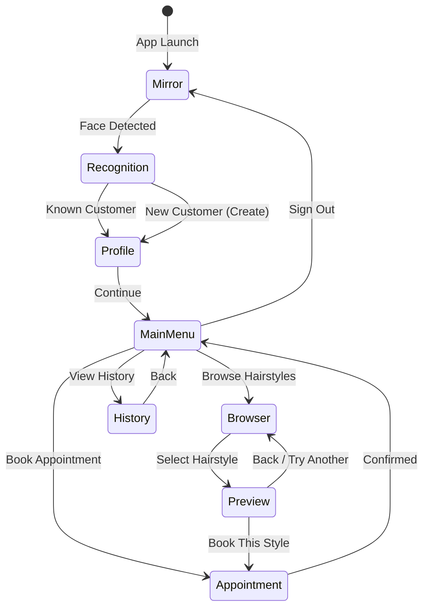
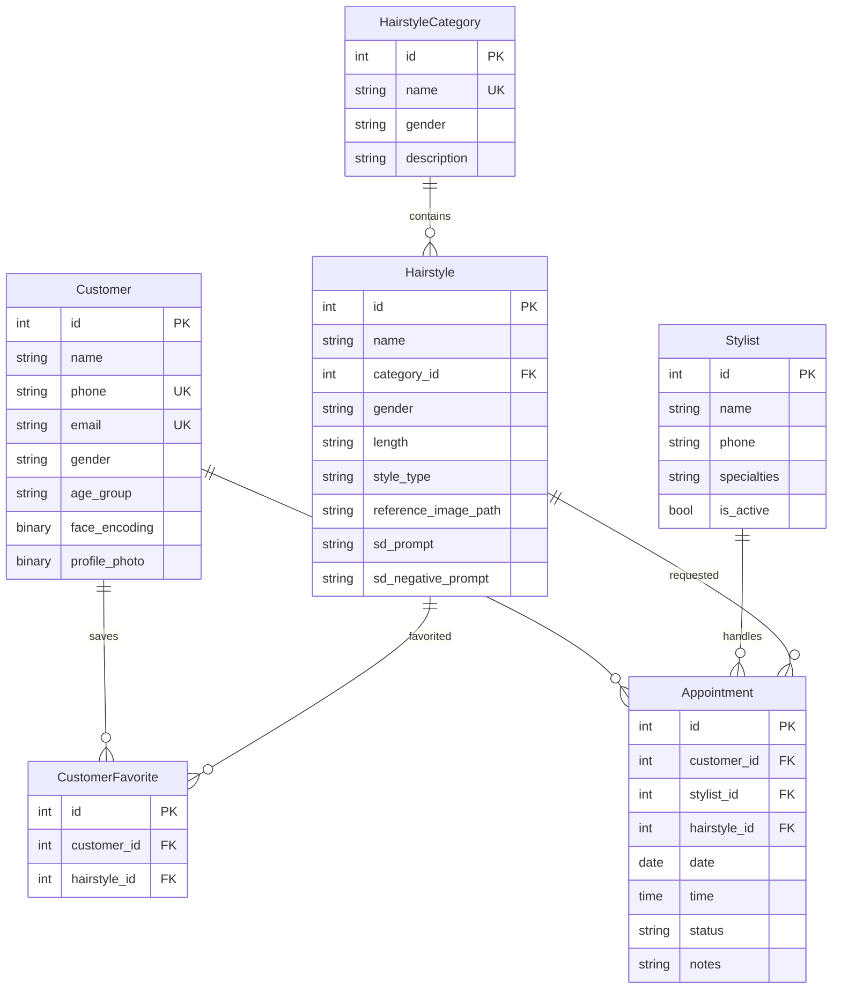
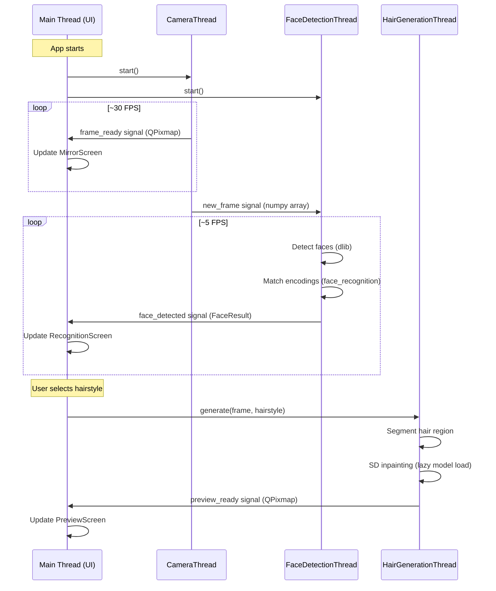
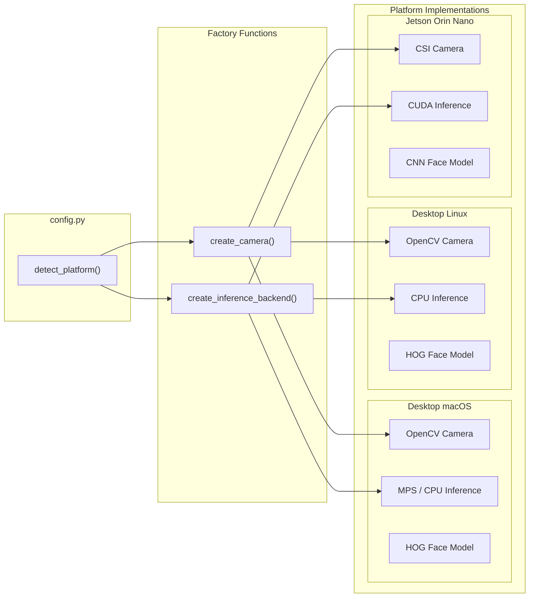

# Architecture Overview

## System Architecture

```mermaid
graph TB
    subgraph Entry["Entry Point"]
        main["main.py<br/>SmartMirrorController"]
    end

    subgraph Config["Configuration"]
        config["config.py<br/>Platform Detection &<br/>Environment Config"]
    end

    subgraph UI["UI Layer (PyQt5)"]
        app["ui/app.py<br/>SmartMirrorApp<br/>(QStackedWidget)"]

        subgraph Screens["Screens"]
            mirror["MirrorScreen"]
            recog["RecognitionScreen"]
            profile["ProfileScreen"]
            menu["MainMenuScreen"]
            browser["HairstyleBrowserScreen"]
            preview["HairstylePreviewScreen"]
            appt["AppointmentScreen"]
            history["HistoryScreen"]
        end

        subgraph Threads["Worker Threads"]
            cam_t["CameraThread<br/>~30 FPS"]
            face_t["FaceDetectionThread<br/>~5 FPS"]
            hair_t["HairGenerationThread<br/>On-demand"]
        end

        subgraph Widgets["Reusable Widgets"]
            cam_w["CameraWidget"]
            face_w["FaceOverlayWidget"]
            card_w["HairstyleCard"]
            nav_w["NavBar"]
        end
    end

    subgraph Core["Core Layer (No UI Dependencies)"]
        subgraph Hardware["Hardware Abstraction"]
            base["CameraBackend<br/>InferenceBackend<br/>(Abstract)"]
            cam_desk["DesktopCamera<br/>(OpenCV)"]
            cam_jet["JetsonCamera<br/>(CSI)"]
            inf_cpu["CPUInference"]
            inf_cuda["CUDAInference"]
            cam_fact["create_camera()"]
            inf_fact["create_inference_backend()"]
        end

        subgraph Face["Face Detection & Recognition"]
            detector["detector.py<br/>Face Detection"]
            recognizer["recognizer.py<br/>Face Matching"]
            face_svc["face_service.py<br/>FaceService"]
        end

        subgraph Hair["Hair Processing"]
            catalog["catalog.py<br/>HairstyleCatalog"]
            segmenter["segmenter.py<br/>Hair Segmentation"]
            generator["generator.py<br/>SD Inpainting"]
            preview_svc["preview_service.py<br/>HairPreviewService"]
        end

        subgraph Services["Business Services"]
            cust_svc["CustomerService"]
            appt_svc["AppointmentService"]
            styl_svc["StylistService"]
        end
    end

    subgraph DB["Database Layer"]
        engine["engine.py<br/>SQLAlchemy Session"]
        models["models.py<br/>ORM Models"]
        seed["seed.py<br/>Hairstyle Catalog Seeder"]
    end

    subgraph Assets["Assets"]
        styles["QSS Stylesheets"]
        icons["Icons"]
        fonts["Fonts"]
        ref_imgs["Hairstyle Reference Images"]
    end

    %% Connections
    main --> config
    main --> app
    main --> cam_t & face_t & hair_t

    app --> Screens
    Screens --> Widgets

    cam_t -- "Qt Signals<br/>(frames)" --> mirror
    face_t -- "Qt Signals<br/>(face data)" --> recog
    hair_t -- "Qt Signals<br/>(preview img)" --> preview

    cam_t --> cam_fact
    face_t --> face_svc
    hair_t --> preview_svc

    cam_fact --> cam_desk & cam_jet
    inf_fact --> inf_cpu & inf_cuda
    cam_fact --> config
    inf_fact --> config

    face_svc --> detector & recognizer
    preview_svc --> segmenter & generator
    generator --> inf_fact

    Services --> engine
    engine --> models
    main --> seed

    app --> styles

    classDef entry fill:#4a9eff,stroke:#2d7ad4,color:#fff
    classDef ui fill:#7c4dff,stroke:#5c35cc,color:#fff
    classDef core fill:#00bfa5,stroke:#009688,color:#fff
    classDef db fill:#ff9100,stroke:#e67e00,color:#fff
    classDef config fill:#ff5252,stroke:#d43d3d,color:#fff

    class main entry
    class app,mirror,recog,profile,menu,browser,preview,appt,history,cam_t,face_t,hair_t,cam_w,face_w,card_w,nav_w ui
    class base,cam_desk,cam_jet,inf_cpu,inf_cuda,cam_fact,inf_fact,detector,recognizer,face_svc,catalog,segmenter,generator,preview_svc,cust_svc,appt_svc,styl_svc core
    class engine,models,seed db
    class config config
```

## Screen Navigation Flow

```mermaid
stateDiagram-v2
    [*] --> Mirror: App Launch

    Mirror --> Recognition: Face Detected
    Recognition --> Profile: Known Customer
    Recognition --> Profile: New Customer (Create)
    Profile --> MainMenu: Continue

    MainMenu --> Browser: Browse Hairstyles
    MainMenu --> Appointment: Book Appointment
    MainMenu --> History: View History

    Browser --> Preview: Select Hairstyle
    Preview --> Browser: Back / Try Another
    Preview --> Appointment: Book This Style

    Appointment --> MainMenu: Confirmed
    History --> MainMenu: Back

    MainMenu --> Mirror: Sign Out
```

## Data Model (Entity Relationships)

```mermaid
erDiagram
    Customer ||--o{ Appointment : books
    Customer ||--o{ CustomerFavorite : saves
    Stylist ||--o{ Appointment : handles
    HairstyleCategory ||--o{ Hairstyle : contains
    Hairstyle ||--o{ CustomerFavorite : favorited
    Hairstyle ||--o{ Appointment : requested

    Customer {
        int id PK
        string name
        string phone UK
        string email UK
        string gender
        string age_group
        binary face_encoding
        binary profile_photo
    }

    Stylist {
        int id PK
        string name
        string phone
        string specialties
        bool is_active
    }

    HairstyleCategory {
        int id PK
        string name UK
        string gender
        string description
    }

    Hairstyle {
        int id PK
        string name
        int category_id FK
        string gender
        string length
        string style_type
        string reference_image_path
        string sd_prompt
        string sd_negative_prompt
    }

    Appointment {
        int id PK
        int customer_id FK
        int stylist_id FK
        int hairstyle_id FK
        date date
        time time
        string status
        string notes
    }

    CustomerFavorite {
        int id PK
        int customer_id FK
        int hairstyle_id FK
    }
```

## Threading Model

```mermaid
sequenceDiagram
    participant Main as Main Thread (UI)
    participant Cam as CameraThread
    participant Face as FaceDetectionThread
    participant Hair as HairGenerationThread

    Note over Main: App starts
    Main->>Cam: start()
    Main->>Face: start()

    loop ~30 FPS
        Cam->>Main: frame_ready signal (QPixmap)
        Main->>Main: Update MirrorScreen
    end

    Cam->>Face: new_frame signal (numpy array)

    loop ~5 FPS
        Face->>Face: Detect faces (dlib)
        Face->>Face: Match encodings (face_recognition)
        Face->>Main: face_detected signal (FaceResult)
        Main->>Main: Update RecognitionScreen
    end

    Note over Main: User selects hairstyle
    Main->>Hair: generate(frame, hairstyle)
    Hair->>Hair: Segment hair region
    Hair->>Hair: SD inpainting (lazy model load)
    Hair->>Main: preview_ready signal (QPixmap)
    Main->>Main: Update PreviewScreen
```

## Platform Abstraction

```mermaid
graph LR
    subgraph Factory["Factory Functions"]
        cf["create_camera()"]
        if_["create_inference_backend()"]
    end

    subgraph Detection["config.py"]
        pd["detect_platform()"]
    end

    subgraph Platforms["Platform Implementations"]
        subgraph macOS["Desktop macOS"]
            m1["OpenCV Camera"]
            m2["MPS / CPU Inference"]
            m3["HOG Face Model"]
        end
        subgraph Linux["Desktop Linux"]
            l1["OpenCV Camera"]
            l2["CPU Inference"]
            l3["HOG Face Model"]
        end
        subgraph Jetson["Jetson Orin Nano"]
            j1["CSI Camera"]
            j2["CUDA Inference"]
            j3["CNN Face Model"]
        end
    end

    pd --> cf & if_
    cf --> m1 & l1 & j1
    if_ --> m2 & l2 & j2
```
